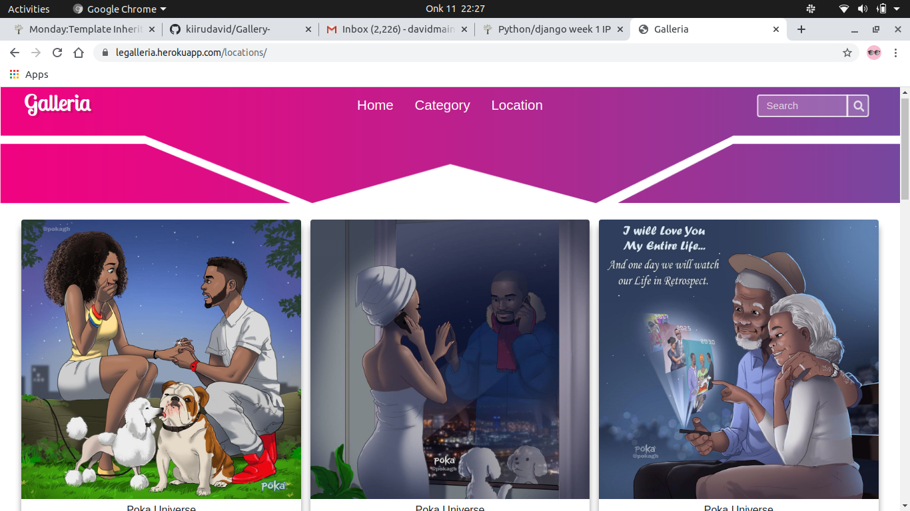

# Tambua Kenya
 


#### By:
1. Joseph Nganga ; lead developer
1. Moringa TM's ; Mentors
1. Moringa Students ; Assistant designers

### Description  
This is an application that enables users to view different categories of images per locations and also able to copy the link and share it to other friends.

### Deployed link
<a href="https://django-data.herokuapp.com/"> The link</a>


### BDD
| Behavior | Input | Output | 
| -------- | ----- | ------ |
| View all posted photos | click over a photo | Shown details about the photo 
| Details about the photo | Click on Copy Link | Pop up that shows that the image link has been copied appears | 
| Details about the photo | Click on View Image | Photo expands | 
| Search in the search field | Input keywords to be searched then press ENTER | Search page is loaded and displays with the searched results | 

## Setup and Installation  
To get the project .......  
#### Cloning the repository:  

##### Navigate into the folder and install requirements  
 ```bash 
cd gallery pipenv  install -r requirements.txt 
```
##### Install and activate Virtual  
 ```bash 
- python3 -m venv virtual - source virtual/bin/activate  
```  
##### Install Dependencies  
 ```bash 
 pipenv install -r requirements.txt 
```  
 ##### Setup Database  
  SetUp your database User,Password, Host then make migrate  
 ```bash 
python manage.py makemigrations gallery
 ``` 
 Now Migrate  
 ```bash 
 python manage.py migrate 
```
##### Run the application  
 ```bash 
 python manage.py runserver 
```  

##### Testing the application  
 ```bash 
 python manage.py test 
```
Open the application on your browser `127.0.0.1:8000`.  
  
  
## Technology used  
  
* [Python3.6](https://www.python.org/)  
* [Django 2.2.9](https://docs.djangoproject.com/en/2.2/)  
* [Heroku](https://heroku.com)  
* [Git](for version control)
  
  
## Known Bugs  
* There are no known bugs currently,though i encountered many of it during deployment,but i finally managed 
## Support and contact details
call me on

:0798734442

:0778378174
 
 :nungari100@gmail.com

## License

[MIT License](LICENSE.md)
Copyright (c) [2020] [Joseph Nganga]